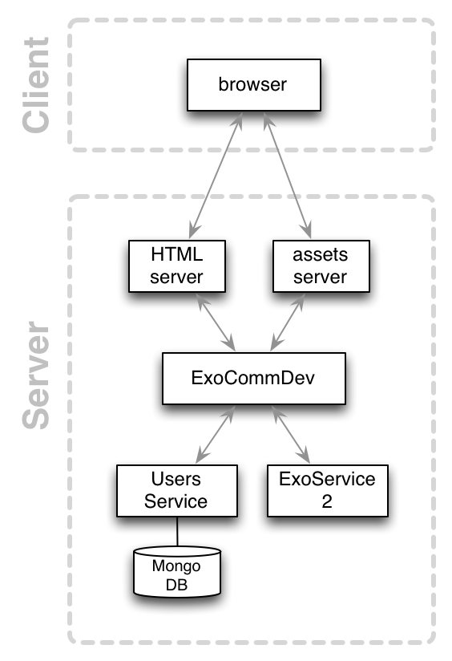

# SpaceTweet Example Application

SpaceTweet is a medium-sized example Exosphere application.
It is a Twitter clone that allows to
* log in as a user
* tweet things
* comment on tweets

## Architecture

This app consists of the following services:

* [web server](web-server): serves the web UI to the outside world
* [users service](https://github.com/Originate/exosphere-users-service): stores user information (name, email, ...)

Future work:
* [sessions service](sessions_service): stores who is logged in
* [tweets service](tweets_service): stores tweet data (content)
* [comments service](comments_service): stores comments for tweets

